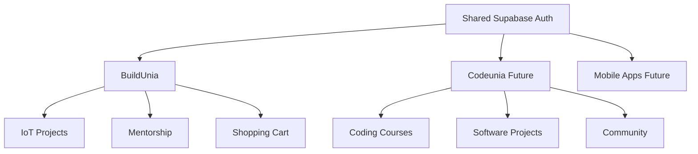

# BuildUnia Architecture Recommendations

## Executive Summary
BuildUnia should remain a standalone application with a unified authentication system that can scale to support future Codeunia integration.

## Authentication Architecture

### Recommended Approach: Unified Auth Service



### Implementation Strategy

#### Phase 1: Enhanced Standalone (Current)
- ✅ Modern auth system with Supabase
- ✅ Role-based access control
- ✅ Email verification
- 🔄 Add social login (Google, GitHub)
- 🔄 Add user profiles with preferences
- 🔄 Add subscription management

#### Phase 2: Cross-Platform Ready (3-6 months)
- 🔮 JWT token sharing between platforms
- 🔮 Unified user profiles
- 🔮 Cross-platform notifications
- 🔮 Shared billing system

#### Phase 3: Full Integration (6+ months)
- 🔮 Single dashboard for all services
- 🔮 Unified learning paths
- 🔮 Cross-platform analytics

## Database Strategy

### Current: Supabase (Recommended to Continue)
- **Pros**: Real-time features, built-in auth, edge functions, great DX
- **Cons**: Vendor lock-in (manageable with SQL standards)

### Tables to Add for Enhanced Features:
```sql
-- User Profiles (Enhanced)
ALTER TABLE profiles ADD COLUMN preferences JSONB;
ALTER TABLE profiles ADD COLUMN subscription_tier TEXT DEFAULT 'free';
ALTER TABLE profiles ADD COLUMN last_active TIMESTAMP DEFAULT NOW();

-- Cross-Platform Integration
CREATE TABLE user_sessions (
  id UUID PRIMARY KEY DEFAULT gen_random_uuid(),
  user_id UUID REFERENCES auth.users(id),
  platform TEXT NOT NULL, -- 'buildunia', 'codeunia'
  session_data JSONB,
  created_at TIMESTAMP DEFAULT NOW(),
  expires_at TIMESTAMP
);

-- Unified Notifications
CREATE TABLE notifications (
  id UUID PRIMARY KEY DEFAULT gen_random_uuid(),
  user_id UUID REFERENCES auth.users(id),
  title TEXT NOT NULL,
  message TEXT NOT NULL,
  type TEXT NOT NULL, -- 'order', 'course', 'mentorship'
  platform TEXT NOT NULL,
  read BOOLEAN DEFAULT FALSE,
  created_at TIMESTAMP DEFAULT NOW()
);
```

## Deployment Strategy

### Option 1: Separate Deployments (Recommended)
```
BuildUnia: buildunia.vercel.app
Codeunia: codeunia.vercel.app
Auth API: auth.codeunia.com (shared)
```

### Option 2: Monorepo with Subdomains
```
Main: codeunia.com
Marketplace: marketplace.codeunia.com
Learning: learn.codeunia.com
```

## Technical Debt Considerations

### Current Strengths:
- ✅ Modern Next.js 15 with App Router
- ✅ TypeScript for type safety
- ✅ Well-structured component library
- ✅ Stripe integration for payments
- ✅ Professional UI with shadcn/ui

### Areas for Future Enhancement:
- 🔄 Add comprehensive error handling
- 🔄 Implement caching strategy (Redis/Upstash)
- 🔄 Add monitoring (Sentry, Analytics)
- 🔄 Add testing suite (Jest, Playwright)
- 🔄 Add CI/CD pipeline

## Security Recommendations

### Current Auth Security:
- ✅ Supabase RLS (Row Level Security)
- ✅ JWT tokens
- ✅ HTTPS enforcement

### Additional Security Measures:
- 🔄 Rate limiting on auth endpoints
- 🔄 CAPTCHA for registration
- 🔄 Two-factor authentication option
- 🔄 Session management improvements
- 🔄 Audit logging for sensitive operations

## Performance Optimization

### Frontend:
- 🔄 Implement service worker for offline functionality
- 🔄 Add image optimization
- 🔄 Implement proper code splitting
- 🔄 Add performance monitoring

### Backend:
- 🔄 Database query optimization
- 🔄 Implement proper caching
- 🔄 Add CDN for static assets
- 🔄 Optimize API response times

## Conclusion

**Recommendation**: Keep BuildUnia standalone but design for future integration. Your current architecture is solid and scalable. Focus on perfecting the user experience before attempting complex integrations.

The authentication system should be enhanced to support future cross-platform scenarios while maintaining simplicity for current users.
